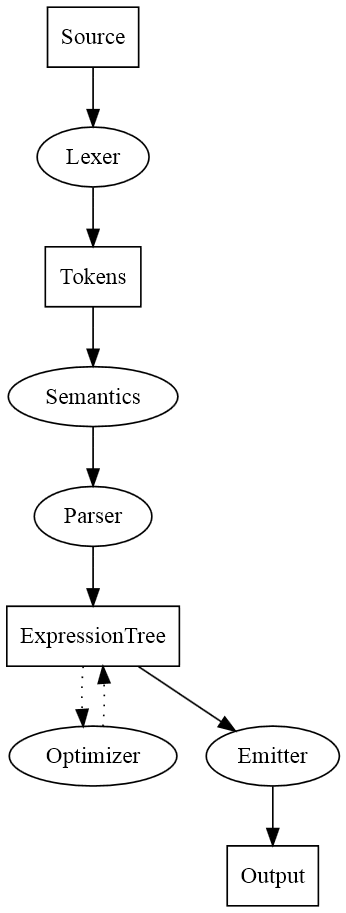

Based on [Building Expression Evaluator with Expression Trees in C# - Part 1](http://www.aboutmycode.com/net-framework/building-expression-evaluator-with-expression-trees-in-csharp-part-1/) ff.

# Architecture



```
digraph Compiler {
    Source          -> Lexer
    Lexer           -> Tokens
    Tokens          -> Semantics
    Semantics       -> Parser
    Parser          -> ExpressionTree
    ExpressionTree  -> Optimizer -> ExpressionTree [style=dotted]
    ExpressionTree  -> Emitter
    Emitter         -> Output

    Source          [shape=box]
    Tokens          [shape=box]
    ExpressionTree  [shape=box]
    Output          [shape=box]
}
```